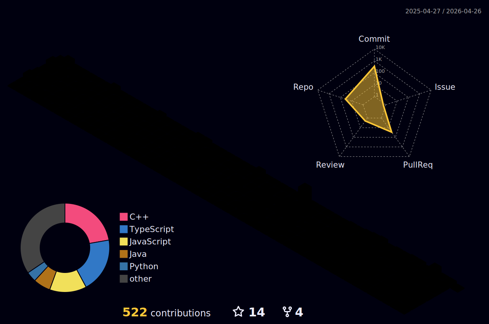

<div align="center">

<!-- Animated Header -->


</div>

<!-- ═══════════════════════════════════════════════════════════════════════════════════════════════ -->
<div align="center">
  
# 👋 Hi, I'm Bhanu Partap

### 🎓 BTech Student | 💻 Tech Enthusiast | 🚀 Passionate Developer


</div>

<!-- ═══════════════════════════════════════════════════════════════════════════════════════════════ -->

## 🌐 Connect With Me

<div align="center">

[](mailto:partapbhanu516@gmail.com)
[](https://x.com/bhanupartap59)
[](https://linkedin.com/in/bhanu-partap13)
[](https://stackoverflow.com/users/23019533/bhanu-partap)
[](https://discord.com/users/bhanu__partap)

</div>


<!-- ═══════════════════════════════════════════════════════════════════════════════════════════════ -->

## 🏆 GitHub Trophies


<div align="center">


</div>


<!-- ═══════════════════════════════════════════════════════════════════════════════════════════════ -->

## 🎖️ Holopin Badges

<div align="center">

[](https://holopin.io/@bhanupartap13)

</div>


<!-- ═══════════════════════════════════════════════════════════════════════════════════════════════ -->

## 👨‍💻 About Me

<div align="left">


```bash
Bhanu-partap-13@github:~$ ./welcome.sh
```

<br/>

- 👋 Hello! I'm **Bhanu Partap**, a passionate developer
- 💻 Currently learning and building amazing projects
- 🚀 Exploring new technologies and frameworks
- 🛠️ Love working with JavaScript, Python, and more
- 🎯 Goal: Contributing to open source and building cool stuff
- 🎧 Coding sessions powered by good music
- 🤝 Let's connect and build something awesome together!

</div>

<br clear="right"/>


<!-- ═══════════════════════════════════════════════════════════════════════════════════════════════ -->

## 💻 Tech Stack

<div align="center">

### Programming Languages


### Frameworks & Libraries


### Databases


### Tools & Platforms


</div>


<!-- ═══════════════════════════════════════════════════════════════════════════════════════════════ -->

## 📊 GitHub Stats


<div align="center">

<table>
  <tbody>
    <tr>
      <th>
        <a href="https://nirzak-streak-stats.vercel.app/?user=Bhanu-partap-13&locale=en&mode=daily&theme=dracula&hide_border=false&border_radius=5&order=3&card_height=235">
          
        </a>
      </th> 
      <th>
        <a href="https://github-readme-stats.vercel.app/api/top-langs?username=Bhanu-partap-13&show_icons=true&locale=en&langs_count=12&theme=dracula&layout=compact&card_width=380&card_height=400">
          
        </a>
      </th>
    </tr>
  </tbody>
</table>
  
<table>
  <tbody>
    <tr>
      <th>
        <a href="https://github-readme-stats.vercel.app/api?username=Bhanu-partap-13&show_icons=true&locale=en&">
          
        </a>
      </th>
      <th>
        <a href="https://github-profile-summary-cards.vercel.app/api/cards/profile-details?username=Bhanu-partap-13">
          
        </a>
      </th>
    </tr>
  </tbody>
</table>

</div>


<br>

### 📈 3D Contribution Graph


<div align="center">
  
</div>
<br>


<!-- ═══════════════════════════════════════════════════════════════════════════════════════════════ -->

### 🐍 Snake Eating My Contributions


<div align="center">
  <picture>
    <source media="(prefers-color-scheme: dark)" srcset="https://raw.githubusercontent.com/Bhanu-partap-13/bhanu-partap/output/github-snake-dark.svg" />
    <source media="(prefers-color-scheme: light)" srcset="https://raw.githubusercontent.com/Bhanu-partap-13/bhanu-partap/output/github-snake.svg" />
    
  </picture>
</div>

<div align="center">
<br>
  
  
  
  
  **Thanks for visiting my profile! 🙏**
  
  *Feel free to explore my repositories and don't hesitate to reach out for collaborations!*
</div>
